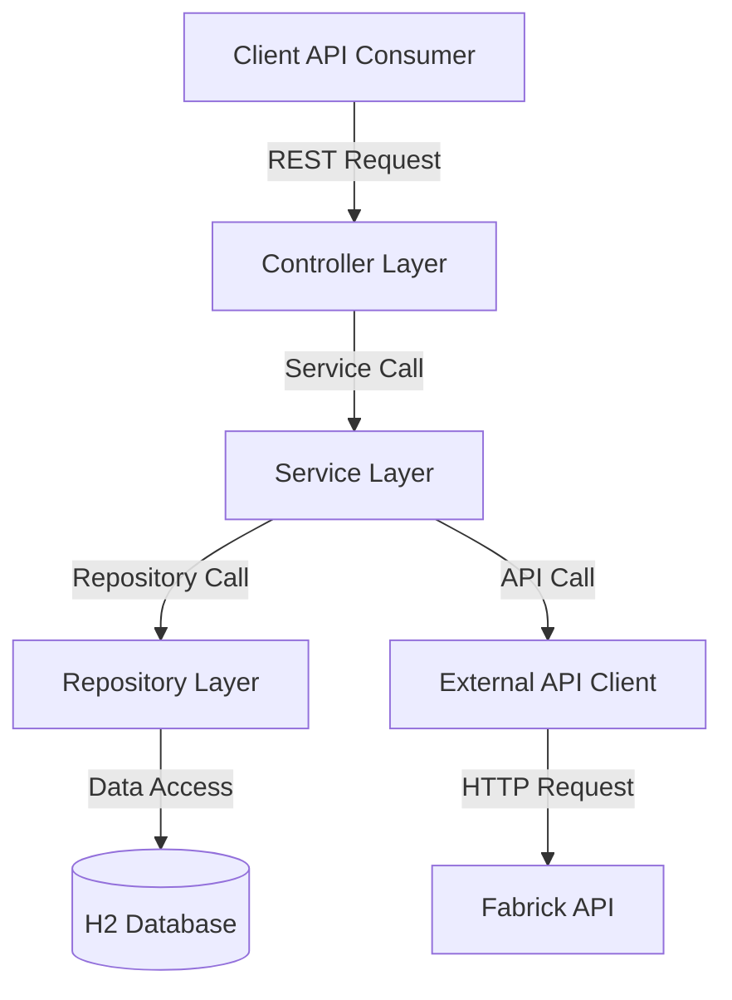
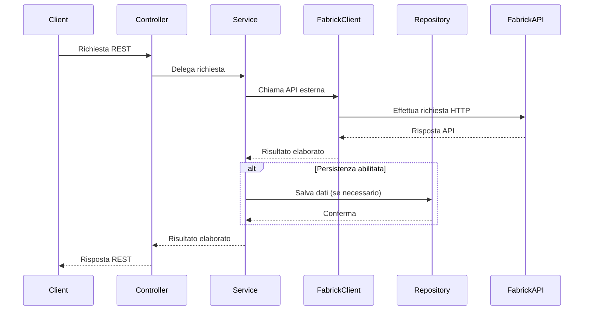

# Documentazione API Fabrick

## Indice
1. [Panoramica del Progetto](#panoramica-del-progetto)
2. [Architettura](#architettura)
3. [Componenti Principali](#componenti-principali)
4. [API REST Esposte](#api-rest-esposte)


## Panoramica del Progetto

Questo progetto implementa un servizio REST che agisce come intermediario per l'accesso alle API bancarie esposte da Fabrick. Il servizio offre funzionalità per:

- Consultare il saldo di un conto
- Visualizzare l'elenco delle transazioni in un periodo specificato
- Effettuare bonifici (NON è funzionante in sandbox)

La soluzione è sviluppata in Java utilizzando il framework Spring Boot, con un'architettura a più livelli che garantisce una chiara separazione delle responsabilità.

## Architettura

L'applicazione segue un'architettura a strati con i seguenti componenti principali:



### Flusso di Elaborazione delle Richieste



## Componenti Principali

### Moduli Principali

L'applicazione è organizzata nei seguenti moduli principali:

1. **Controller Layer**: Gestisce le richieste HTTP in entrata e restituisce le risposte appropriate
2. **Service Layer**: Contiene la logica di business e coordina l'interazione tra i repository e i client esterni
3. **Repository Layer**: Gestisce la persistenza dei dati
4. **Client Layer**: Interagisce con le API esterne di Fabrick
5. **DTO (Data Transfer Objects)**: Oggetti utilizzati per il trasferimento dei dati tra i vari strati
6. **Modello del Dominio**: Rappresenta le entità di business dell'applicazione
7. **Exception Handling**: Gestione centralizzata degli errori
8. **Configuration**: Configurazione dell'applicazione

### Struttura dei Pacchetti

```
com.orbyta_admission_quiz
├── client/                  # Client API esterni
    └── fabrick/             # Client delle API Fabrick
├── config/                  # Configurazioni Spring
├── controller/              # REST controllers
├── dto/                     # Data Transfer Objects
│   ├── account/             # Oggetti conto
│       ├──── request/       # Oggetti richiesta
│       ├──── response/      # Oggetti risposta
│   ├── payments/            # Oggetti pagamenti
│       ├──── request/       # Oggetti richiesta
│       ├──── response/      # Oggetti risposta
│   └── errors/              # Oggetti di errore
├── exception/               # Classi per la gestione delle eccezioni
├── repository/              # Interfacce di accesso ai dati
├── service/                 # Servizi di business logic
│   └── impl/                # Implementazioni dei servizi
└── util/                    # Classi di utilità
```

