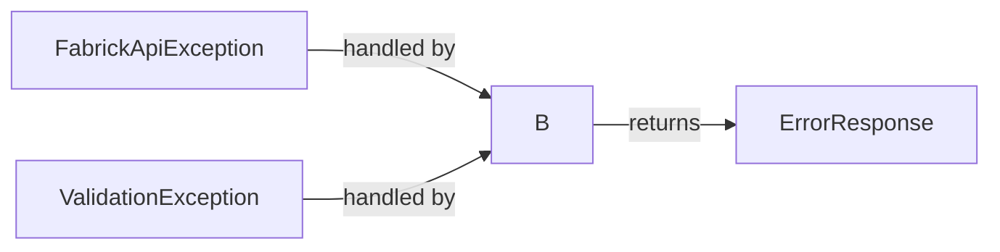

# Documentazione API Fabrick

## Indice
1. [Panoramica del Progetto](#panoramica-del-progetto)
2. [Architettura](#architettura)
3. [Componenti Principali](#componenti-principali)
4. [API REST Esposte](#api-rest-esposte)
5. [Integrazione con Fabrick API](#integrazione-con-fabrick-api)
6. [Persistenza Dati (Opzionale)](#persistenza-dati-opzionale)
7. [Testing](#testing)
8. [Gestione degli Errori](#gestione-degli-errori)
9. [Configurazione](#configurazione)
10. [Come Eseguire](#come-eseguire)
11. [Postman Collection](#postman-collection)

## Panoramica del Progetto

Questo progetto implementa un servizio REST che agisce come intermediario per l'accesso alle API bancarie esposte da Fabrick. Il servizio offre funzionalità per:

- Consultare il saldo di un conto
- Visualizzare l'elenco delle transazioni in un periodo specificato
- Effettuare bonifici (NON è funzionante in sandbox)

La soluzione è sviluppata in Java utilizzando il framework Spring Boot, con un'architettura a più livelli che garantisce una chiara separazione delle responsabilità.

## Architettura

L'applicazione segue un'architettura a strati con i seguenti componenti principali:


### Flusso di Elaborazione delle Richieste


## Componenti Principali

### Moduli Principali

L'applicazione è organizzata nei seguenti moduli principali:

1. **Controller Layer**: Gestisce le richieste HTTP in entrata e restituisce le risposte appropriate
2. **Service Layer**: Contiene la logica di business e coordina l'interazione tra i repository e i client esterni
3. **Repository Layer**: Gestisce la persistenza dei dati
4. **Client Layer**: Interagisce con le API esterne di Fabrick
5. **DTO (Data Transfer Objects)**: Oggetti utilizzati per il trasferimento dei dati tra i vari strati
6. **Modello del Dominio**: Rappresenta le entità di business dell'applicazione
7. **Exception Handling**: Gestione centralizzata degli errori
8. **Configuration**: Configurazione dell'applicazione

### Struttura dei Pacchetti

```
com.orbyta_admission_quiz
├── client/                  # Client API esterni
    └── fabrick/             # Client delle API Fabrick
├── config/                  # Configurazioni Spring
├── controller/              # REST controllers
├── dto/                     # Data Transfer Objects
│   ├── account/             # Oggetti conto
│       ├──── request/       # Oggetti richiesta
│       ├──── response/      # Oggetti risposta
│   ├── payments/            # Oggetti pagamenti
│       ├──── request/       # Oggetti richiesta
│       ├──── response/      # Oggetti risposta
│   └── errors/              # Oggetti di errore
├── exception/               # Classi per la gestione delle eccezioni
├── repository/              # Interfacce di accesso ai dati
├── service/                 # Servizi di business logic
│   └── impl/                # Implementazioni dei servizi
└── util/                    # Classi di utilità
```


## API REST Esposte

L'applicazione espone le seguenti API REST:

### 1. Consultazione Saldo

```
GET /api/v1/accounts/{accountId}/balance
```

**Parametri URL**:
- `accountId`: ID del conto (Long)

**Risposta di successo**:
```json
{
    "balance": -3.06,
    "availableBalance": -3.06,
    "currency": "EUR",
    "date": "2025-04-09"
}
```

### 2. Lista Transazioni

```
GET /api/v1/accounts/{accountId}/transactions?fromAccountingDate=2019-04-01&toAccountingDate=2019-06-01
```

**Parametri URL**:
- `accountId`: ID del conto (Long)

**Parametri Query**:
- `fromAccountingDate`: Data di inizio (formato YYYY-MM-DD)
- `toAccountingDate`: Data di fine (formato YYYY-MM-DD)

**Risposta di successo**:
```json
[
    {
        "transactionId": "314569",
        "operationId": "00000000314569",
        "accountingDate": "2019-05-31",
        "valueDate": "2019-06-01",
        "amount": -28.40,
        "currency": "EUR",
        "description": "PD VISA CORPORATE 04",
        "accountId": 14537780
    },
    {
        "transactionId": "038917",
        "operationId": "00000000038917",
        "accountingDate": "2019-04-30",
        "valueDate": "2019-05-01",
        "amount": -62.40,
        "currency": "EUR",
        "description": "PD VISA CORPORATE 03",
        "accountId": 14537780
    }
]
```

### 3. Esecuzione Bonifico

```
POST /api/v1/accounts/14537780/payments/money-transfers
```

**Parametri URL**:
- `accountId`: ID del conto (Long)

**Corpo della richiesta**:
```json
{
    "creditor": {
        "name": "John Doe",
        "account": {
            "accountCode": "IT23A0336844430152923804660",
            "bicCode": "SELBIT2BXXX"
        },
        "address": {
            "address": null,
            "city": null,
            "countryCode": null
        }
    },
    "executionDate": "2025-05-01",
    "uri": "REMITTANCE_INFORMATION",
    "description": "Payment invoice 75/2017",
    "amount": 800,
    "currency": "EUR",
    "isUrgent": false,
    "isInstant": false,
    "feeType": "SHA",
    "feeAccountId": "14537780",
    "taxRelief": {
        "taxReliefId": "L449",
        "isCondoUpgrade": false,
        "creditorFiscalCode": "56258745832",
        "beneficiaryType": "NATURAL_PERSON",
        "naturalPersonBeneficiary": {
            "fiscalCode1": "MRLFNC81L04A859L"
        },
        "legalPersonBeneficiary": {
            "fiscalCode": null,
            "legalRepresentativeFiscalCode": null
        }
    }
}
```

**Risposta attuale** (nell'ambiente sandbox):
```json
{
    "method": "createMoneyTransfer",
    "step": "Fabrick API",
    "rawErrorMessage": "400 Bad Request on POST request for \"https://sandbox.platfr.io/api/gbs/banking/v4.0/accounts/14537780/payments/money-transfers\": \"{<EOL><EOL>  \"status\" : \"KO\",<EOL><EOL>  \"errors\" :  [<EOL><EOL>??{<EOL><EOL>???\"code\" : \"API000\",<EOL><EOL>???\"description\" : \"IbanBeneficiario è obbligatorio\",<EOL><EOL>???\"params\" : \"\"<EOL><EOL>??}<EOL><EOL>?],<EOL><EOL>  \"payload\": {}<EOL><EOL>}\"",
    "timestamp": "2025-04-09T01:22:42.554071",
    "errorDetails": {
        "status": "KO",
        "errors": [
            {
                "code": "API000",
                "description": "IbanBeneficiario è obbligatorio",
                "params": ""
            }
        ],
        "payload": {}
    },
    "status": 400
}
```

## Integrazione con Fabrick API

L'applicazione si integra con le seguenti API di Fabrick:

### Endpoint utilizzati

1. **Lettura Saldo**:
   ```
   GET {baseUrl}/api/gbs/banking/v4.0/accounts/{accountId}/balance
   ```

2. **Lista Transazioni**:
   ```
   GET {baseUrl}/api/gbs/banking/v4.0/accounts/{accountId}/transactions?fromAccountingDate={fromAccountingDate}&toAccountingDate={toAccountingDate}
   ```

3. **Bonifico**:
   ```
   POST {baseUrl}/api/gbs/banking/v4.0/accounts/{accountId}/payments/money-transfers
   ```

### Configurazione dell'Integrazione


## Persistenza Dati (Opzionale)

L'applicazione include un modulo opzionale per la persistenza dei dati utilizzando un database H2 in memoria:

### Schema del Database


## Testing

L'applicazione include test unitari e di integrazione per garantire la qualità e la robustezza del codice:

### Strategia di Test


Le categorie principali di test includono:

1. **Test Unitari**:
   - Test dei controller con MockMvc
   - Test dei servizi con Mockito
   - Test dei repository

2. **Test di Integrazione**:
   - Test end-to-end con database in memoria
   - Test di integrazione delle API

## Gestione degli Errori

L'applicazione implementa una gestione centralizzata degli errori utilizzando `@ControllerAdvice` e gestori di eccezioni personalizzati:



### Tipi di Errori Gestiti

1. **Errori API esterne**: Gestisce gli errori restituiti dalle API Fabrick
2. **Errori di validazione**: Gestisce gli errori di validazione dei dati in input
3. **Errori generici**: Gestisce qualsiasi altro tipo di errore imprevisto

## Configurazione

Le principali configurazioni dell'applicazione sono gestite tramite:
######  - `application.yml`:

```properties
spring:
  application:
    name: orbyta-quiz
  profiles:
    active: sandbox
```
Questo garantisce che l'applicazione utilizzi il file application-sandbox.yml per le configurazioni specifiche dell'ambiente.

######  - `application-sandbox.yml`:
```properties
spring:
  datasource:
    url: jdbc:h2:mem:fabrickdb
    driverClassName: org.h2.Driver
    username: sa
    password:
  jpa:
    database-platform: org.hibernate.dialect.H2Dialect
  h2:
    console:
      enabled: true
      path: /h2-console
logging:
  level:
    com.orbyta_admission_quiz: DEBUG
    org:
      springframework:
        web:
          client:
            RestTemplate: DEBUG
fabrick:
  api:
    baseUrl: https://sandbox.platfr.io
springdoc:
  api-docs:
    path: /v3/api-docs
  swagger-ui:
    path: /swagger-ui.html
    operationsSorter: method
    tagsSorter: alpha
    expansion: none
server:
  port: 8081
```
## Come Eseguire

### Prerequisiti
- Java 17
- Maven

### Comandi

1. **Clonare il repository**:
   ```bash
   git clone https://github.com/SoyHub/OrbyaQuiz?tab=readme-ov-file#integrazione-con-fabrick-api
   ```

2. **Compilare e creare il pacchetto**:
   ```bash
   mvn clean package
   ```

3. **Eseguire l'applicazione**:
   ```bash
   java -jar target/orbyta-quiz-0.0.1-SNAPSHOT.jar
   ```

4. **Eseguire i test**:
   ```bash
   mvn test
   ```
   
## Postman Collection
La collezione Postman per testare le API è disponibile nel file `resources/postman/ORBYTA-QUIZ.postman_collection.json`. 
Si puo importare questo file in Postman per testare le API direttamente.
Si ricorda di importare anche l'ambiente Postman: 
- `Orbyta-Quiz-Local.postman_environment.json` (per l'esecuzione locale)
- `Orbyta-Quiz-Sandbox.postman_environment.json` (per l'esecuzione in sandbox)

